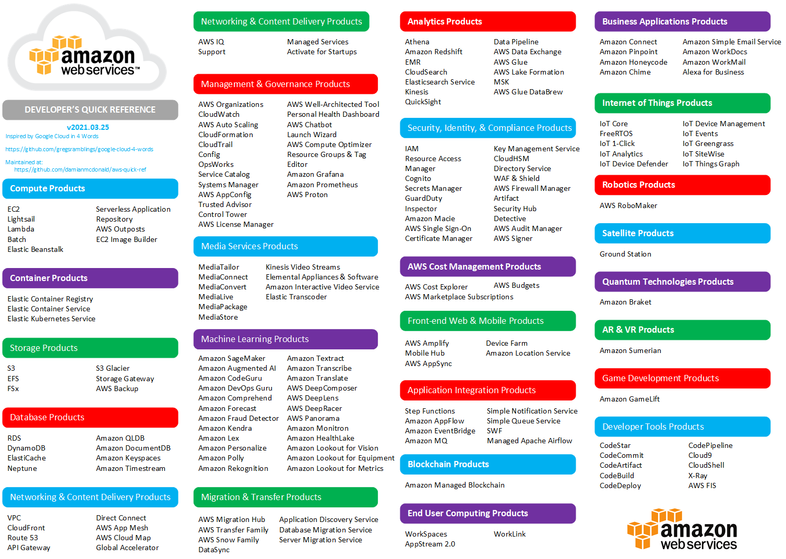

# The AWS Developer's Quick Reference

Inspired by the [google-gloud-4-words](https://github.com/gregsramblings/google-cloud-4-words) Developer's Cheat Sheet, this AWS Developer's Quick Reference diagram is intended to list all current AWS services by category.

Unlike the google-gloud-4-words example, the AWS Developer's Quick Reference diagram only *lists* the services - it does not describe them.

# Diagram formats

The AWS Developer's Quick Reference diagram is available in the following formats:

| File   | Format |
|----------|----------|
| [aws-quick-ref.drawio](aws-quick-ref.drawio) |  draw.io |
| [aws-quick-ref.pdf](aws-quick-ref.pdf) |    PDF   |
| [aws-quick-ref.png](aws-quick-ref.png) |    PNG   |
| [aws-quick-ref.svg](aws-quick-ref.svg) | SVG (Scalable Vector Graphics) |
| [aws-quick-ref.vsd](aws-quick-ref.vsd) | Microsoft Visio (2003-2010 Drawing) |
| [aws-quick-ref.vsdx](aws-quick-ref.vsdx) | Microsoft Visio |